Exercice 1 : Initialisation du dépôt, réservation GPU, et lancement de la UI via SSH

Question 1.a Vous allez initialiser votre dépôt Git et préparer l’environnement d’exécution. Le serveur dispose déjà d’un environnement conda avec PyTorch installé : réutilisez-le. Point important : réservez d’abord une GPU via SLURM avant d’installer des bibliothèques, afin d’éviter de bloquer le nœud de connexion SLURM. 

Question 1.b Créez un nouveau dépôt Git (sur la plateforme habituelle) et créez le dossier TP1/ avec l’arborescence minimale ci-dessous. 

Question 1.c Mettez à jour votre rapport TP1/report/report.md avec :

- le lien de votre dépôt (ou un placeholder que vous remplacerez plus tard)
https://github.com/Robert-ung/CSC8608

- l’endroit où vous exécutez le TP (local ou nœud GPU via SLURM),
Nœud GPU distant (via réservation SLURM).

- l’arborescence TP1/ (un simple aperçu, pas besoin de copier toutes les commandes).
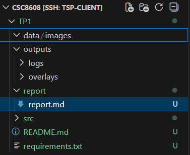

Question 1.d Sur le serveur, réservez une GPU via SLURM. Une fois sur le nœud GPU, activez l’environnement conda existant. 

mamba activate deeplearning

Question 1.e Mettez à jour votre rapport avec :

- le nom de l’environnement conda activé : deeplearning

- une preuve que CUDA est disponible (ex : capture terminal ou une phrase avec les valeurs clés).

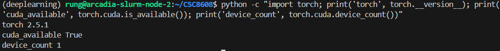

Question 1.f Installez les dépendances sur la machine de calcul (le nœud GPU). Remplissez TP1/requirements.txt avec les bibliothèques nécessaires au TP. Vous devez au minimum avoir : Streamlit, OpenCV, et SAM. 

Question 1.g  Mettez à jour votre rapport avec une preuve que l’import de segment_anything fonctionne (capture terminal ou phrase courte).

Question 1.g Préparez l’accès à la UI Streamlit via SSH. Vous devez choisir un port non utilisé par les autres étudiants (ex : 8511, 8512, 8513…). Ensuite, lancez Streamlit sur le nœud GPU en écoutant sur 0.0.0.0.

Distinguez bien : (1) lancer Streamlit sur le nœud GPU (machine de calcul), et (2) créer le tunnel SSH depuis votre machine locale (votre PC).
# Sur le nœud GPU (dans le dossier de votre repo)
PORT=8533
streamlit run TP1/src/app.py --server.port $PORT --server.address 0.0.0.0
      
# Sur votre machine locale (port forwarding SSH)
ssh -L $PORT:localhost:$PORT nodeX_tsp
      
Question 1.i Mettez à jour votre rapport avec :

- le port choisi : 8533
- une capture d’écran montrant Streamlit ouvert dans le navigateur (URL visible)
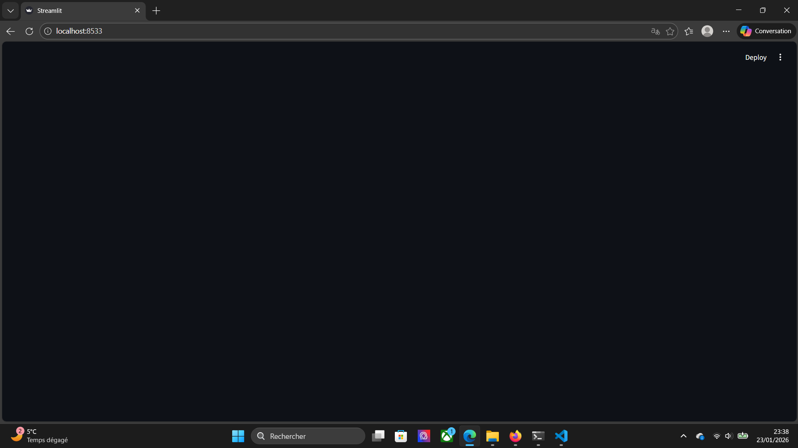

- un court commentaire : “UI accessible via SSH tunnel : oui/non”.
L'UI est accessible via SSH tunnel : oui

Exercice 2 : Constituer un mini-dataset (jusqu’à 20 images)

Question 2.a Récupérez jusqu’à 20 images et placez-les dans TP1/data/images/. Choisissez des images “réelles” (pas uniquement des objets détourés sur fond blanc). 

Question 2.b Mettez à jour votre rapport avec :

- le nombre d’images final : 18 (récupérées via sources Web libres de droits)

- une liste de 5 images représentatives (nom de fichier + 1 phrase sur pourquoi elle est intéressante)

oiseau_simple.jpg : objet unique sur fond bleu
outil_simple.jpg : objet unique sur fond blanc
bureau_chargé.jpg : plusieurs objets sur bureau avec fond complexe
grillage_difficile.jpg : grillage et câble avec fond complexe
verre_difficile.jpg : verre transparent avec reflet et ombre

- au moins 2 captures d’écran (ou vignettes) montrant un cas simple et un cas difficile.

exemple de cas simple : 

exemple de cas difficile : 

Exercice 3 : Charger SAM (GPU) et préparer une inférence “bounding box → masque”

Question 3.a Téléchargez les poids SAM (checkpoint) sur la machine de calcul et placez-les dans un dossier TP1/models/. Vous devez créer ce dossier et vérifier que le fichier est présent. 

Question 3.b Complétez TP1/src/sam_utils.py pour charger SAM sur le bon device et créer un SamPredictor. Les parties _______ doivent être remplacées par du code correct. 

Question 3.d Testez rapidement votre fonction avec une image de TP1/data/images/ et une bbox “à la main” (valeurs numériques), sur la machine de calcul. L’objectif est juste de vérifier que :

- le modèle se charge sur GPU (si dispo),
- la fonction renvoie bien un masque de taille (H,W),
- le score est un float raisonnable.

Question 3.e Mettez à jour votre rapport avec :

- le modèle choisi (vit_h par exemple) et le nom du checkpoint utilisé (sans l’ajouter au dépôt) : 

Modèle : ViT-H (Huge)
Checkpoint utilisé : sam_vit_h_4b8939.pth
Périphérique : CUDA (GPU) détecté et utilisé.

- une capture du test rapide (sortie console) montrant la shape de l’image, du masque, et le score,

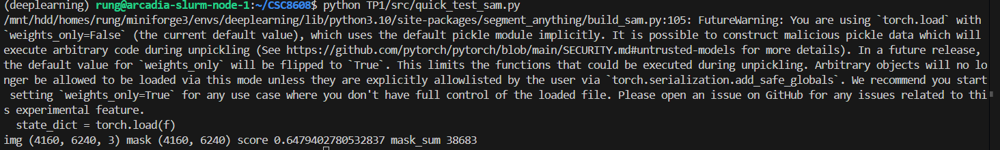

- un court commentaire (3–5 lignes) sur un premier constat : “ça marche / c’est lent / limites observées”.

Le système est opérationnel. L’inférence est fonctionnelle sur GPU malgré une résolution d'image très élevée (4160x6240). Le chargement du modèle vit_h est un peu lourd, mais l'exécution reste fluide. Cependant, le score de confiance (0.64) et le faible nombre de pixels segmentés montrent les limites d'une bounding box arbitraire sur une image de cette taille : pour obtenir un masque précis, il sera crucial d'avoir une interface interactive permettant de définir une zone pertinente.

Exercice 4 : Mesures et visualisation : overlay + métriques (aire, bbox, périmètre)

Question 4.a Complétez TP1/src/geom_utils.py pour calculer : (1) aire en pixels, (2) bbox du masque, (3) périmètre approximatif. Remplacez uniquement les _______. 

Question 4.b  Complétez TP1/src/viz_utils.py pour générer un overlay lisible. La fonction doit :

- prendre une image RGB (uint8), un masque booléen, et une bbox,
- dessiner la bbox,
- superposer le masque avec transparence (alpha),
- retourner une image RGB (uint8).

Question 4.c Faites un test rapide (hors UI) : chargez une image, définissez une bbox “à la main”, exécutez SAM, calculez les métriques, générez l’overlay, puis sauvegardez-le dans TP1/outputs/overlays/. 

Question 4.d Mettez à jour votre rapport avec :

- une capture d’écran (ou vignette) d’un overlay produit
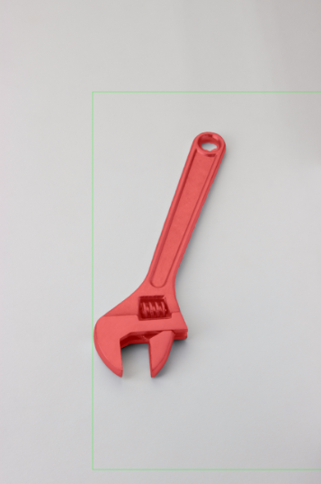
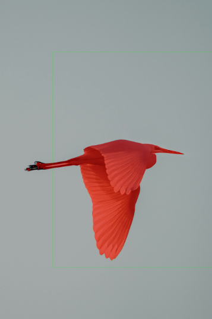

- un mini-tableau (3 lignes) récapitulant image → score → aire → périmètre pour 3 images

Le score SAM représente la confiance du modèle, un peu comme une note sur un, où on considère qu'au-dessus de 0,9, l'IA est certaine d'avoir bien détouré l'objet. Si le score chute, c'est souvent parce que la zone sélectionnée est ambiguë ou que l'objet se confond avec le décor.

L'aire nous donne simplement la taille de la surface rouge en nombre de pixels, ce qui permet de mesurer l'espace occupé par l'objet dans l'image.

Enfin, le périmètre mesure la longueur du contour de cette forme. On s'en sert pour évaluer la complexité de l'objet, car une silhouette très découpée aura un périmètre beaucoup plus long qu'une forme lisse et simple.

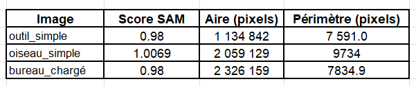

- un commentaire bref (5–8 lignes) : dans quels cas l’overlay aide à “debugger” le modèle/prompt ?

L’overlay est indispensable pour confronter la performance statistique (le score) à la réalité visuelle. Il permet de détecter trois problèmes majeurs : 

Le décalage de prompt car si la bounding box est trop serrée, l'overlay montre que SAM "coupe" les bords de l'objet. 

L'ambiguïté partie/tout : Dans des cas complexes (comme le câble), l'overlay permet de voir si SAM a segmenté l'objet entier ou seulement un petit segment, même si le score est élevé.

Les faux positifs : L'overlay révèle si le modèle a "inventé" une forme dans le bruit de fond. Par exemple il avait détecté une forme d'objet dans un coin supérieur alors qu'il n'y avait rien.

Exercice 5 : Mini-UI Streamlit : sélection d’image, saisie de bbox, segmentation, affichage et sauvegarde

Question 5.a Complétez TP1/src/app.py pour : charger et cacher le predictor SAM (chargé une seule fois), lister les images disponibles dans TP1/data/images/, afficher l’image sélectionnée, proposer 4 sliders pour la bbox, bornés par la taille de l’image, lancer la segmentation au clic sur un bouton, afficher overlay + métriques, permettre la sauvegarde d’un overlay dans TP1/outputs/overlays/.

Question 5.b Lancez l’application Streamlit sur la machine de calcul, puis accédez-y depuis votre navigateur via SSH port forwarding. Testez sur au moins 3 images avec des bboxes différentes. 

Depuis mon cluster node-1, je lance les commandes suivantes : 
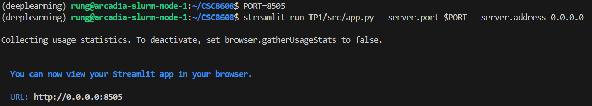

Puis depuis mon PC local, j'ouvre mon terminal WSL (c'est là où j'ai configuré les connexions ssh avec slurm) et j'entre : ssh -L 8505:arcadia-slurm-node-1:8505 tsp-client

Le navigateur va toujours viser l'entrée du tunnel sur la machine locale. Il faut utiliser http://localhost:8505 et non http://0.0.0.0:8505 qui est une adresse utilisée par le serveur (Streamlit) pour dire "j'écoute sur toutes les interfaces réseau du nœud".

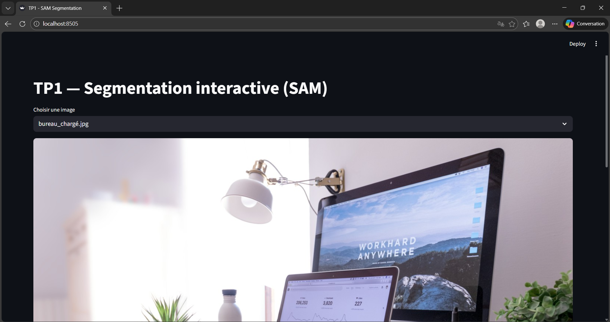

Question 5.c Améliorez l’expérience utilisateur en affichant en live la bounding box sur l’image avant de lancer la segmentation. L’objectif est que l’utilisateur voie immédiatement la zone qui sera segmentée. 

Question 5.d Mettez à jour votre rapport avec :

- 2–3 captures d’écran de l’UI montrant des résultats (un cas simple et un cas difficile),

Cas simple :
 
Cas chargé : 
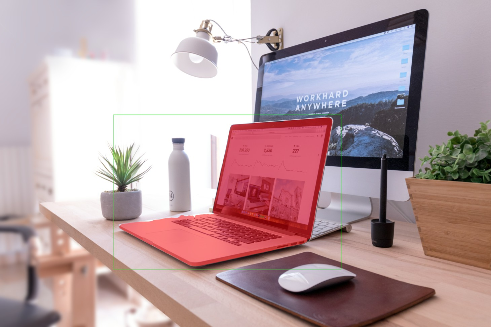
Cas difficile : 
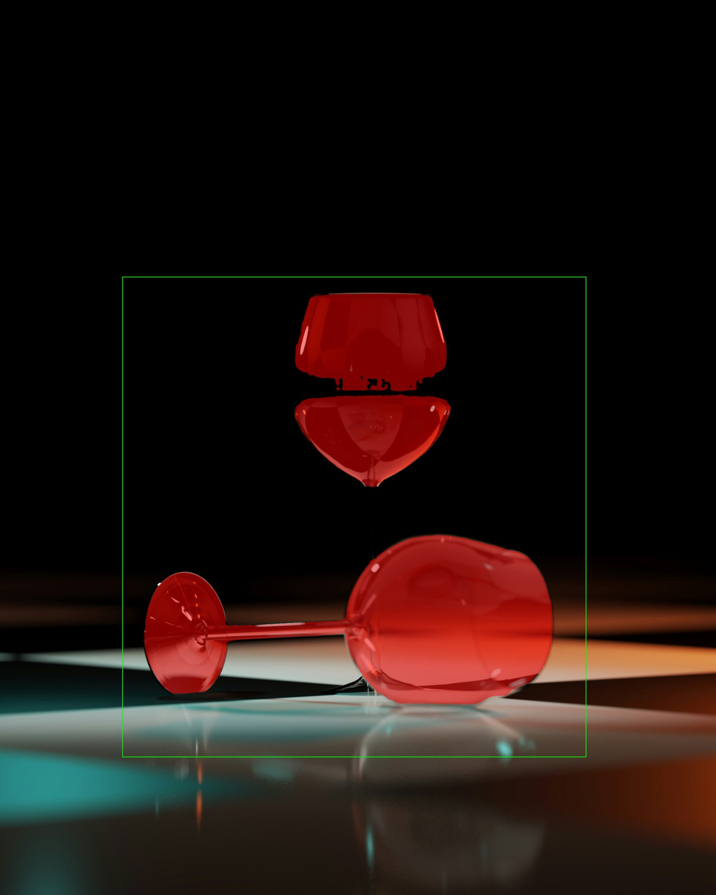

- un tableau (ou liste) de 3 tests : image + bbox (valeurs) + score + aire + temps ms,
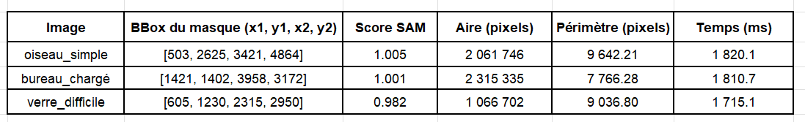

- un court paragraphe “debug” : qu’est-ce qui change quand vous agrandissez/rétrécissez la bbox ?

Lorsqu'on manipule les sliders, on constate que la taille de la boîte change radicalement le comportement du modèle. En rétrécissant trop la BBox (en "serrant" l'objet de trop près), le score de confiance a tendance à augmenter, mais le masque peut devenir incomplet car SAM manque d'informations sur les bords de l'objet. À l'inverse, si on agrandit trop la boîte, on introduit des objets parasites ou du fond complexe, ce qui peut faire chuter le score ou forcer SAM à segmenter plusieurs éléments à la fois. Le "prompt" idéal consiste généralement à laisser une légère marge de 5 à 10% autour de l'objet d'intérêt.

Exercice 6 : Affiner la sélection de l'objet : points FG/BG + choix du masque (multimask)

Question 6.a Avec une simple bounding box, SAM peut produire un masque “plausible” mais pas forcément celui de l’objet que vous visez (cas typique : plusieurs objets dans la bbox, fond complexe, objet fin). Dans cet exercice, vous allez ajouter deux mécanismes simples et très efficaces pour mieux contrôler l’objet segmenté :

- Points de guidage : points foreground (FG) et background (BG) en plus de la bbox.
- Multimask + sélection : SAM peut produire plusieurs masques candidats ; vous permettrez à l’utilisateur de choisir.

Question 6.b Complétez TP1/src/sam_utils.py en ajoutant une fonction qui supporte bbox + points FG/BG et qui renvoie tous les masques candidats (multimask) + leurs scores. Remplacez uniquement les _______. 

Ces ajouts sont cruciaux car on peut maintenant résoudre des situations où la BBox seule échouait :

- Le point Foreground (FG - Label 1) : On l'utilise pour "ancrer" le masque sur une partie spécifique de l'objet, très utile si l'objet est troué ou composé de plusieurs parties disjointes.

- Le point Background (BG - Label 0) : C'est l'outil de "nettoyage". Si SAM inclut un morceau de l'arrière-plan dans le masque, on place un point BG dessus pour lui dire de l'exclure.

- Le Multimask : SAM génère souvent trois masques (objet entier, partie de l'objet, ou sous-partie). En activant multimask=True, on récupère ces trois propositions au lieu d'une seule imposée par l'IA.

Question 6.c Dans TP1/src/app.py, vous allez intégrer les points FG/BG et la sélection multimask sans casser le flux actuel (sélection d’image → sliders bbox → prévisualisation → bouton Segmenter → affichage overlay). Pour éviter les ambiguïtés, suivez l’ordre ci-dessous et insérez le code aux endroits indiqués. 

Question 6.j  Testez sur au moins 2 images difficiles où la bbox contient plusieurs éléments (ou un fond complexe). Pour chaque image, faites :

un essai “bbox seule” (sans points) ; notez si le masque correspond à l’objet voulu,
un essai “bbox + 1 point FG” (sur l’objet voulu),
si nécessaire, ajoutez 1 point BG sur une zone à exclure (fond ou autre objet),
comparez les masques candidats (multimask) et choisissez le meilleur via l’UI.

On utilise les points FG (Foreground/Premier plan) et BG (Background/Arrière-plan) pour lever les ambiguïtés que la boîte seule ne peut pas résoudre :

Le point FG : On le place sur une partie de l'objet que SAM a oubliée. Par exemple, sur mon verre, si le pied du verre n'est pas sélectionné, on pose un point FG dessus pour forcer l'IA à l'inclure dans le masque.

Le point BG : On le place sur un élément intrus qui a été "aspiré" dans le masque par erreur. Si SAM sélectionne le verre et une partie de la table, on pose un point BG sur la table.

Question 6.k Mettez à jour votre rapport avec :

- une comparaison “avant/après” sur 2 images (captures UI) : bbox seule vs bbox + points,

Image 1 : Verre_difficile

Bbox seule (Avant)
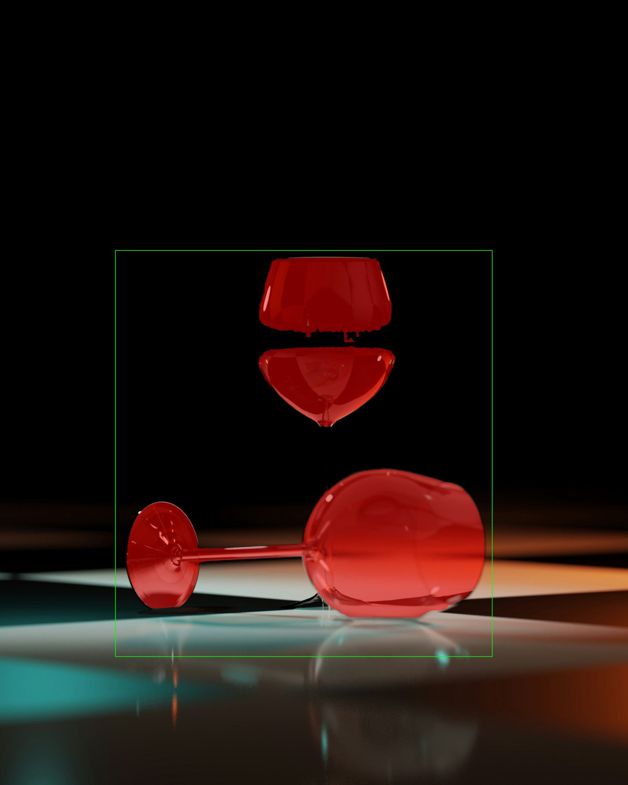
Le masque correspond à l'objet voulu mais il n'a pas capturé l'ensemble de l'objet.

Bbox + points (Après)
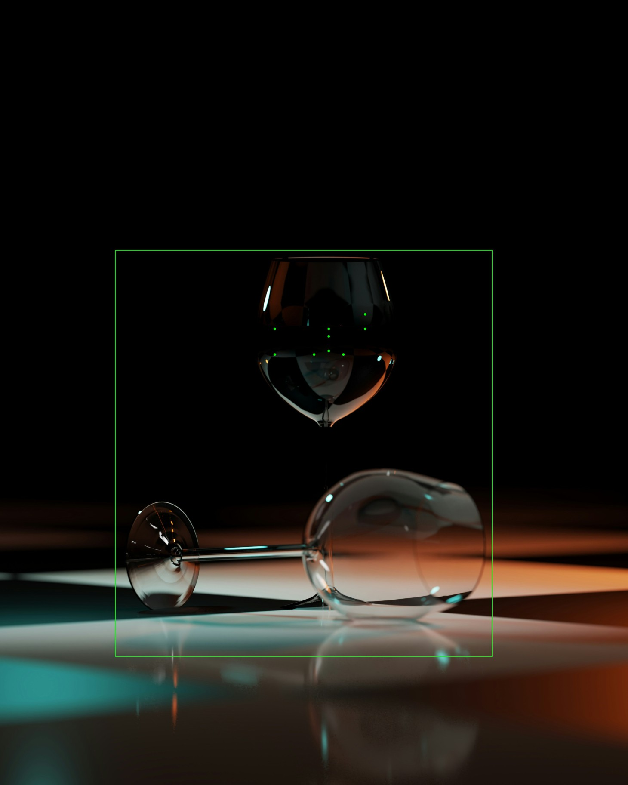
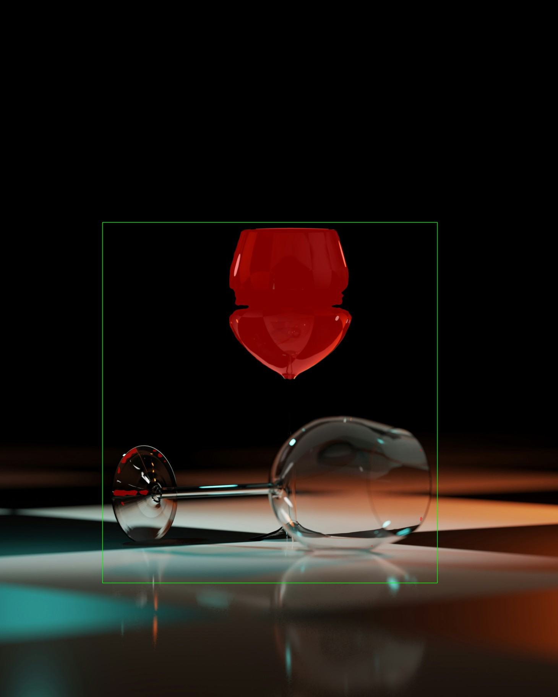
Le masque a été amélioré

Image 2 : grillage_difficile

Bbox seule (avant) 
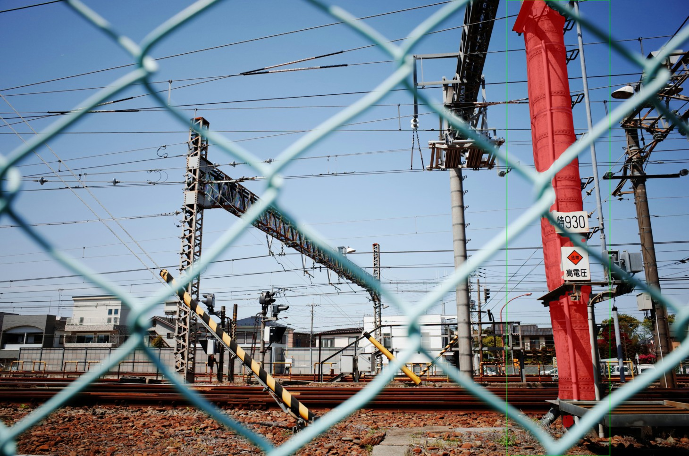
Le masque correspond à l'objet voulu mais il n'a pas capturé l'ensemble de l'objet. Il a quand même réussi sans les points à ne pas inclure le grillage comme étant l'objet désiré.

Bbox + points (Après)
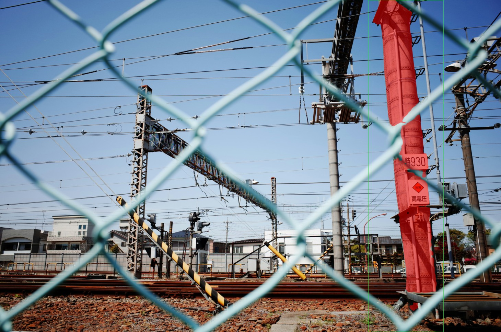
J'ai ajouté des point FG pour inclure les parties manquantes et des point BG pour exlure les parties du grillage qui se sont glissés avec les FG.

- pour chaque cas : la liste des points utilisés (coordonnées + FG/BG) et le masque index choisi

Pour l'image 1 (verre_difficile) : 

Points utilisés : 10 points FG (label 1). On remarque une concentration de points autour de x=1312 à 1744 et y=1500 à 1700 pour forcer SAM à lier les reflets du verre.

Masque choisi : Index 1 (Score : 0.955). C'est le masque le plus confiant et le plus complet pour cet objet complexe.

Pour l'image 2 (grillage_difficile) : 

Points utilisés : 6 points FG (pour l'objet cible) et 2 points BG (label 0) situés à (4103,1686) et (4138,1717) pour demander à SAM d'exclure les mailles du grillage ou le fond visible à travers.

Masque choisi : Index 2 (Score : 0.888). Ce choix manuel permet souvent de sélectionner "l'objet entier" plutôt qu'une simple partie suggérée par les masques 0 ou 1.

- un court paragraphe (6–10 lignes) : dans quels cas les points BG sont indispensables ? quels cas restent difficiles ?

Les points BG (Background) sont indispensables dès que la bounding box englobe des éléments visuellement proches de l'objet cible ou des structures "traversantes" comme un grillage, des câbles ou des reflets. Ils servent de contrainte négative pour forcer SAM à détacher l'objet d'un fond qui partage des textures similaires. Dans le cas du grillage_difficile, sans ces points BG, le modèle aurait tendance à fusionner l'objet derrière et la structure devant.

Cependant, certains cas restent complexes : les objets à forte transparence (le verre) ou les structures extrêmement fines (mailles de grillage, cheveux) posent problème car la frontière entre l'objet et le fond est mathématiquement floue. Même avec plusieurs points, SAM peut avoir du mal à produire un masque "propre" sans petits trous ou bavures, car il doit décider pixel par pixel si l'information appartient au reflet ou à la matière solide.

Exercice 7 : Bilan et réflexion (POC vers produit) + remise finale

Cet exercice final sert à prendre du recul sur votre POC : ce qui marche bien, ce qui est fragile, et ce qu’il faudrait ajouter pour passer à une intégration “produit” (robuste, maintenable, observable).

Question 7.a Dans votre rapport, rédigez une réponse courte (8–12 lignes) à la question suivante : quels sont les 3 principaux facteurs qui font échouer votre segmentation (sur vos images), et quelles actions concrètes (data, UI, pipeline) permettraient d’améliorer la situation ?

On identifie trois facteurs principaux d'échec dans nos essais :

L'ambiguïté des plans (Occlusions/Grillages) : Sur le cas du grillage, SAM peine à dissocier l'objet cible de la structure au premier plan. Action : Imposer une interface de "couches" (layers) ou un post-traitement morphologique pour boucher les trous du masque.

La faible réflectance et transparence : Sur le verre, l'absence de contours nets fait "fuir" le masque. Action : Ajouter un pipeline de pré-traitement pour augmenter le contraste (CLAHE) ou utiliser un dataset spécifique pour le fine-tuning sur des objets translucides.

La précision du prompt initial : Une BBox trop large capture du bruit, tandis qu'une BBox trop serrée ampute l'objet. Action : Améliorer l'UI pour permettre un tracé de BBox assisté par "magnetic lasso" ou forcer l'ajout d'au moins un point FG central par défaut.

Question 7.b Dans votre rapport, rédigez une réponse courte (8–12 lignes) à la question suivante : si vous deviez industrialiser cette brique, que loggueriez-vous et que monitoreriez-vous en priorité ? Donnez au minimum 5 éléments.

Pour passer en production, on doit monitorer les signaux suivants :

- Distribution des Scores de Confiance (SAM Score) : Si la moyenne des scores chute sur une semaine (drift), cela signifie que les images en entrée ont changé (qualité, luminosité, nouveaux objets).

- Temps de latence (Inference Time) : Surveiller le temps de passage dans l'Image Encoder pour détecter une saturation GPU ou un besoin de scaling.

- Ratio Aire Masque / Aire BBox : Un ratio proche de 0 ou de 1 indique souvent une segmentation ratée (masque vide ou remplissage total de la boîte).

- Taux d'interaction utilisateur : Logguer le nombre de points (FG/BG) ajoutés après le premier clic. Un nombre élevé indique que le modèle de base est médiocre pour ce cas d'usage.

- Utilisation de la VRAM : Monitorer les pics de mémoire, surtout avec des images haute résolution (4K+), pour éviter les crashs Out of Memory (OOM).

Question 7.c Remise finale :

- Vérifiez que votre dépôt contient bien TP1/ avec le code source et le rapport.
- Vérifiez que vous n’avez pas ajouté de fichiers trop volumineux (notamment les checkpoints SAM).
- Faites un push de votre dépôt et ajoutez un tag TP1 pointant vers la version rendue.
- Envoyez le lien de votre dépôt à l’enseignant.

