Exercice 1 : Mise en place & smoke test (GPU + Diffusers)

Question 1.a Dans TP2/, installez (ou mettez à jour) les dépendances nécessaires dans l’environnement Python que vous utilisez déjà. Vous n’avez pas besoin de documenter cette étape dans le rapport. 

Question 1.b Réalisez un smoke test sur GPU en générant une seule image (512×512) avec Stable Diffusion v1.5 via un script Python. Créez un fichier TP2/smoke_test.py avec le contenu ci-dessous, puis exécutez-le. 

Résultat dans outputs/smoke.png :

Exercice 2 : Factoriser le chargement du pipeline (text2img/img2img) et exposer les paramètres

Question 2.a Créez le fichier TP2/pipeline_utils.py et complétez les trous (_______) pour obtenir :

- un chargement text2img (StableDiffusionPipeline) avec choix du scheduler,
- un chargement img2img qui réutilise les composants du pipeline text2img,
- un générateur reproductible basé sur la seed.

Question 2.b Créez le fichier TP2/experiments.py (script d’exécution minimal) et complétez les trous pour produire une image text2img “baseline” (512×512) avec des paramètres explicitement définis. Vous devez sauvegarder l’image dans TP2/outputs/. 

Image : 

Configuration utilisée : 

- Modèle : stable-diffusion-v1-5/stable-diffusion-v1-5
- Scheduler : EulerA
- Seed : 42
- Inference Steps : 30
- Guidance Scale (CFG) : 7.5

Exercice 3 : Text2Img : 6 expériences contrôlées (paramètres steps, guidance, scheduler)

Question 3.a Dans TP2/experiments.py, ajoutez une fonction run_text2img_experiments() qui génère automatiquement 6 images (512×512) selon le plan ci-dessous, et les sauvegarde dans TP2/outputs/. 

Question 3.b Exécutez TP2/experiments.py de façon à lancer ces 6 générations. Vous devez obtenir 6 fichiers outputs/t2i_*.png. 

Question 3.c Faites une comparaison qualitative des 6 résultats (sans métrique). Dans votre rapport.md, produisez :

- une grille de captures (ou 6 captures séparées) montrant les résultats,
- un court commentaire (bullet points) décrivant l’effet de steps, guidance et scheduler.

Pour ces expériences, j'ai utilisé le prompt : ultra-realistic product shot of sleek black wireless headphones on a minimalist gray background, studio lighting, sharp focus, professional e-commerce photography

| Run | Paramètre modifié | Image | Observations |
| :--- | :--- | :--- | :--- |
| **01** | **Baseline** (30 steps, G=7.5, EulerA) | 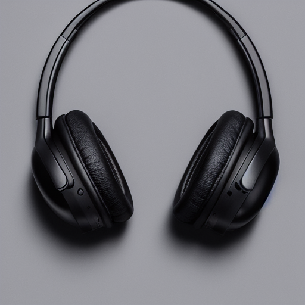 | Image de référence équilibrée. |
| **02** | **Steps bas** (15 steps) | 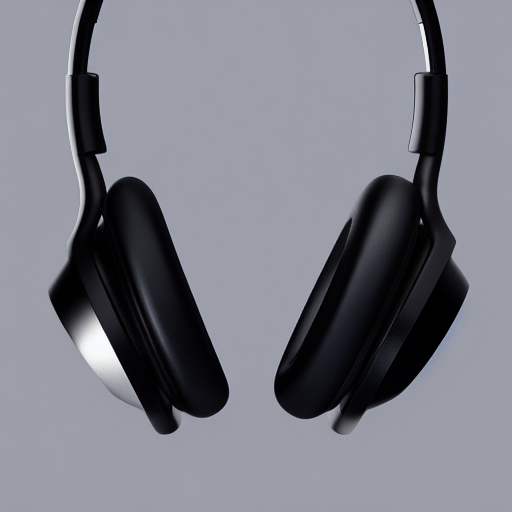 | Manque de netteté sur les textures. |
| **03** | **Steps haut** (50 steps) | 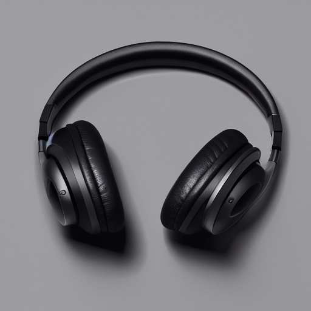 | Détails plus fins mais calcul plus long. |
| **04** | **Guidance bas** (4.0) | 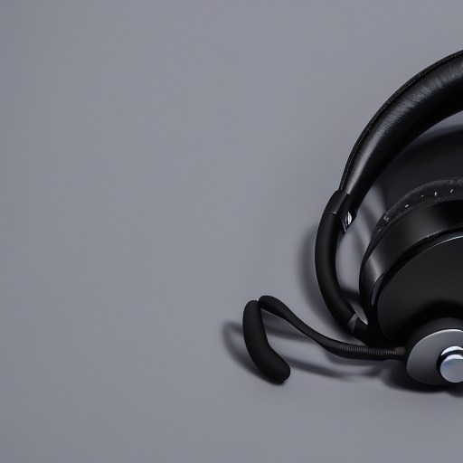 | Formes plus aléatoires, moins "produit". |
| **05** | **Guidance haut** (12.0) | 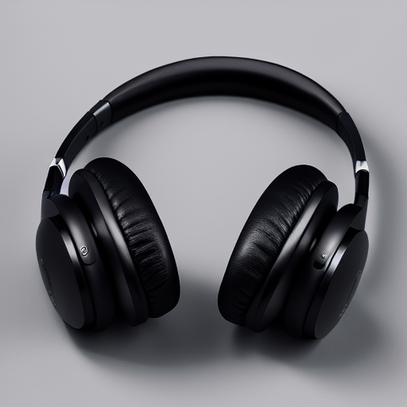 |  |
| **06** | **Scheduler DDIM** (30 steps, G=7.5) |  |  |

Impact du nombre de Steps : Le modèle SD v1.5 converge vers une image cohérente aux alentours de 20-25 étapes. Descendre à 15 réduit drastiquement la qualité (image "non finie"), tandis que monter à 50 offre un rendement décroissant : la qualité sature mais le coût de calcul continue de grimper.

Impact de la Guidance (CFG Scale) : C'est le bouton de "créativité". À 4.0, l'IA interprète librement (parfois trop). À 12.0, elle force les traits du prompt (ultra-réalisme, noir profond), ce qui peut écraser les détails fins au profit d'un contraste exagéré.

Impact du Scheduler : À paramètres égaux, le scheduler change la trajectoire de débruitage. EulerA (Ancestral) ajoute du bruit à chaque étape, ce qui crée des images plus diversifiées et souvent plus esthétiques pour le e-commerce, là où DDIM est plus déterministe et stable.

Exercice 4 : Img2Img : 3 expériences contrôlées (strength faible/moyen/élevé)

Question 4.a Dans TP2/experiments.py, ajoutez une fonction run_img2img_experiments() et complétez les trous pour générer 3 images à partir d’une image source (à fournir par vous). L’image source doit être une image “produit e-commerce” (photo personnelle ou trouvée sur internet). 

Question 4.b Exécutez vos 3 générations Img2Img (les runs 07–09) et obtenez les fichiers outputs/i2i_*.png. Assurez-vous d’avoir aussi une capture “avant” (image source) pour la comparaison.

Question 4.c Dans rapport.md, comparez qualitativement les résultats pour strength=0.35, 0.60 et 0.85 (captures + bullet points). Votre analyse doit inclure :

- ce qui est conservé (forme globale, identité du produit, cadrage),
- ce qui change (textures, arrière-plan, éclairage, détails),
- un commentaire sur l’utilisabilité e-commerce (risque “trop loin” à strength élevé).

Image source de base : 

Run07 (strength=0.35) : 

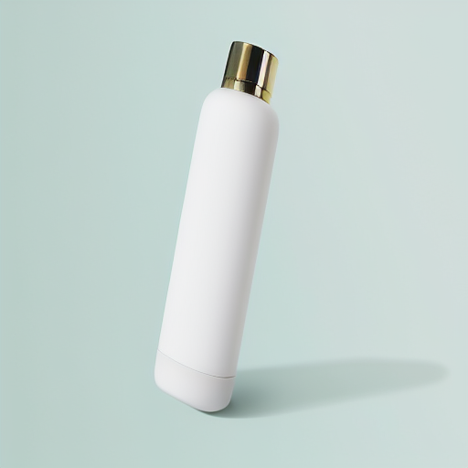

La gourde a conservé sa forme globale, texture, l'éclairage et l'arrière plan. Le cadrage ne bouge pas. En revanche, la forme et la texture du bouchon a changé.

Run08 (strength=0.60) : 

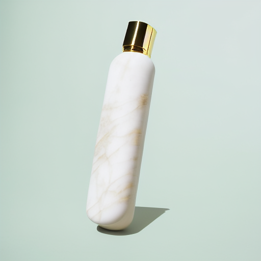

La gourde a conservé sa forme globale, l'éclairage et l'arrière plan. La texture de la gourde a changé, on constate plus de contrastes entre blanc et or. L'ombre a également changé.

Run09 (strength=0.85) :

L'IA a réinventé l'objet. La forme globale a complètement été modifié, le produit original n'est plus reconnaissable. L'éclairage, la texture, l'arrière plan n'est plus identique.

En contexte professionnel "produit", le choix du strength est critique :

Le risque du "trop loin" : À un niveau élevé (0.85), le rendu est esthétique mais mensonger. Pour un site marchand, l'image ne correspond plus au produit réel en stock, ce qui rend l'outil inutilisable pour de la présentation technique.

Le "Sweet Spot" : Pour du e-commerce, on privilégiera des valeurs entre 0.40 et 0.55. Cela permet de placer un produit réel dans un nouveau décor (background removal/replacement) ou de corriger des défauts d'éclairage sans altérer l'objet que le client va acheter.

Exercice 5 : Mini-produit Streamlit (MVP) : Text2Img + Img2Img avec paramètres

Question 5.a Créez (ou complétez) TP2/app.py en ajoutant un bloc “imports + chargement caché (cache)” ci-dessous. Complétez les trous (_______). 

Question 5.b Ajoutez maintenant un bloc “UI” (sidebar + zones de texte) qui permet de sélectionner :

- le mode (Text2Img / Img2Img),
- les paramètres : seed, steps, guidance, scheduler,
- le prompt et le negative_prompt,
- pour Img2Img : upload de l’image + strength.

Question 5.c Ajoutez le bloc “génération” : au clic sur Generate, exécutez soit text2img soit img2img, affichez l’image de sortie et affichez la configuration (paramètres) sous forme lisible. Complétez les trous. 

Text2Img :

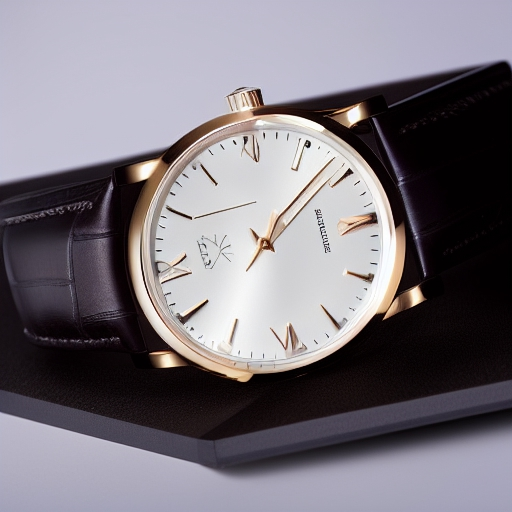
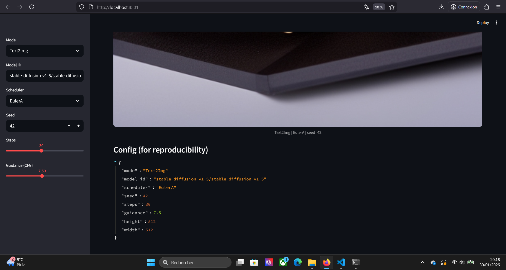

Img2Img : 

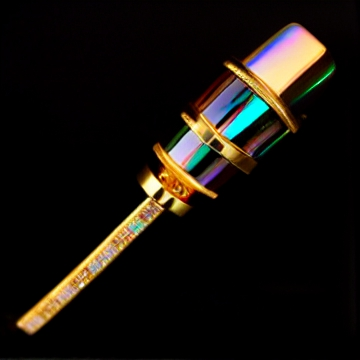
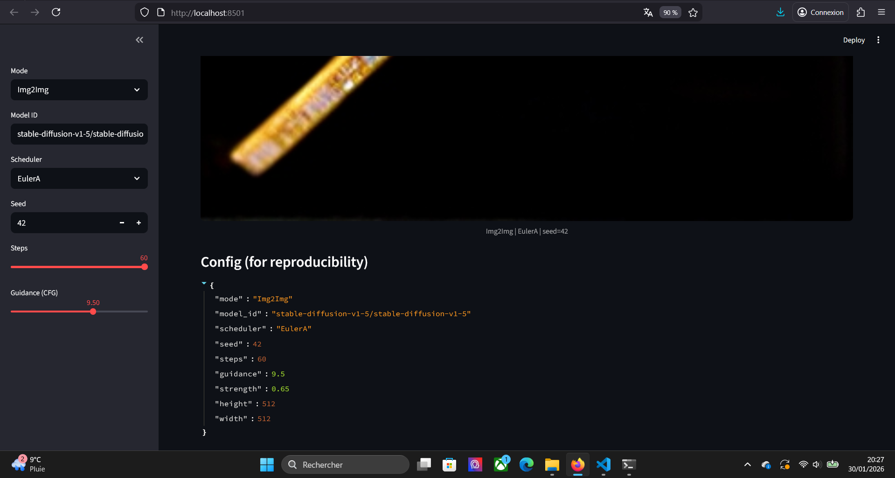

Exercice 6 : Évaluation (léger) + réflexion (à finir à la maison)

Question 6.a Dans rapport.md, définissez et utilisez la grille d’évaluation “light” suivante (scores entiers 0–2), puis calculez un total sur 10.

- Prompt adherence (0–2)
- Visual realism (0–2)
- Artifacts (0–2) — 2 = aucun artefact gênant
- E-commerce usability (0–2) — 2 = publiable après retouches mineures
- Reproducibility (0–2) — 2 = paramètres suffisants pour reproduire

Question 6.b Évaluez au moins 3 images parmi vos générations :

- une text2img baseline,
- une text2img avec un paramètre “extrême” (guidance haut ou steps bas/haut),
- une img2img à strength élevé.

Pour chacune : reportez les 5 scores (0–2), le total sur 10, et 2–3 bullets de justification. 

| Type de génération | Image | Adherence | Realism | Artifacts | Usability | Repro. | **Total (/10)** |
| :--- | :---: | :---: | :---: | :---: | :---: | :---: | :---: |
| **1. Baseline** (Run 01) |  | 2 | 2 | 2 | 2 | 2 | **10** |
| **2. Extrême** (Guidance 12) |  | 2 | 1 | 2 | 1 | 2 | **8** |
| **3. Img2Img** (Strength 0.85) |  | 2 | 0 | 1 | 0 | 2 | **5** |

Justification :

* **Baseline (Run 01) :** Équilibre optimal. L'image est nette, fidèle au prompt et ne présente aucune déformation. C'est le standard de production visé.
* **Extrême (Guidance 12) :** L'IA suit le prompt de manière trop rigide. Le rendu est "sur-traité" avec un contraste excessif et des couleurs saturées, ce qui nuit au réalisme.
* **Img2Img (Strength 0.85) :** À ce niveau, l'IA réinvente la géométrie du produit. Bien que l'image soit esthétique, elle perd toute utilité commerciale car elle ne représente plus le produit réel.

Question 6.c Rédigez un paragraphe de réflexion (8–12 lignes) à la fin de rapport.md. Il doit obligatoirement couvrir les 3 points suivants :

- Le compromis quality vs latency/cost quand on ajuste steps/scheduler.
- La reproductibilité : quels paramètres sont nécessaires et ce qui peut casser.
- Les risques en e-commerce : hallucinations, images trompeuses, conformité (logos/texte), et ce que vous feriez pour limiter ces risques.

L’ajustement des paramètres révèle un arbitrage constant entre qualité visuelle et efficacité opérationnelle. Augmenter le nombre de steps améliore la finesse des détails mais accroît la latence et le coût de calcul par image, alors que le choix du scheduler (comme EulerA) permet souvent d'atteindre une convergence esthétique satisfaisante en moins d'étapes. 

Concernant la reproductibilité, elle repose sur la fixation de la seed, du scheduler et de la version précise du modèle ; cependant, un changement de hardware (GPU différent) ou de librairie logicielle (version de diffusers) peut briser cette stabilité et produire des résultats divergents. 

Enfin, l'usage e-commerce comporte des risques majeurs d'hallucinations où l'IA modifie la structure réelle du produit, créant des images trompeuses non conformes au stock. Les logos et textes restent également un point faible, souvent générés de manière illisible. Pour limiter ces risques, je préconiserais l'utilisation d'un strength modéré en Img2Img, l'ajout de Negative Prompts rigoureux, et idéalement l'intégration de techniques de contrôle plus strictes comme ControlNet pour verrouiller la géométrie du produit original.