Exercice 1 : Initialisation du TP3 et vérification de l’environnement

Question 1.b Dans TP3, créez un fichier sanity_check.py à partir du squelette suivant, puis complétez les trous ________. 

Question 1.c Exécutez sanity_check.py (localement ou via Slurm) et ajoutez au rapport Markdown une capture d’écran montrant : le device détecté, le nom du GPU (si GPU), et les shapes wav_shape/logmel_shape. 

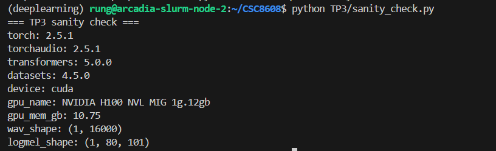

Exercice 2 : Constituer un mini-jeu de données : enregistrement d’un “appel” (anglais) + vérification audio

Question 2.b Créez le dossier TP3/data si nécessaire, puis vérifiez que votre fichier audio est bien présent et raisonnable (durée ~1 minute). Ajoutez au rapport une capture d’écran montrant la commande et les métadonnées (durée, sample rate, canaux). 

ffmpeg -i TP3/data/call_01.wav -ac 1 -ar 16000 TP3/data/call_01.wav

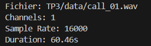

Question 2.e Exécutez inspect_audio.py sur votre audio et ajoutez au rapport une capture d’écran montrant les valeurs affichées. 

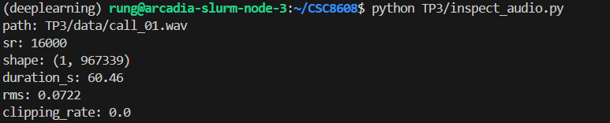

Exercice 3 : VAD (Voice Activity Detection) : segmenter la parole et mesurer speech/silence

Question 3.b Exécutez le script VAD, puis ouvrez le fichier JSON généré. Ajoutez au rapport : une capture d’écran du terminal (les stats) et un extrait de 5 segments (copié/collé) montrant start_s et end_s.
python TP3/vad_segment.py
cat TP3/outputs/vad_segments_call_01.json | head -n 60

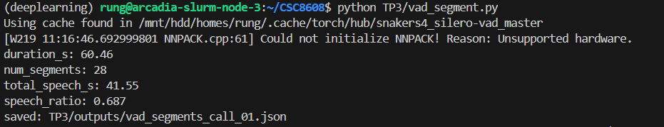

Extrait de 5 segments :

{
  "audio_path": "TP3/data/call_01.wav",
  "sample_rate": 16000,
  "duration_s": 60.4586875,
  "min_segment_s": 0.3,
  "segments": [
    {
      "start_s": 1.73,
      "end_s": 2.366
    },
    {
      "start_s": 2.978,
      "end_s": 6.398
    },
    {
      "start_s": 7.458,
      "end_s": 11.582
    },
    {
      "start_s": 12.706,
      "end_s": 15.838
    },
    {
      "start_s": 16.002,
      "end_s": 16.766
    },]
}

Question 3.c Analyse courte (2–4 lignes) dans le rapport : votre ratio speech/silence vous semble-t-il cohérent avec votre manière de lire le texte (pauses, respiration) ? 

Le ratio de 68.7% semble très cohérent avec ma lecture. Le texte comporte seulement 8 phrases, j'ai donc été obligé de faire des pauses pour tenir 1 minute. Les 31% de silence restants correspondent bien à ces intervalles de transition et aux silences de début et de fin d'enregistrement.

Question 3.d Ajustez le seuil de filtrage min_dur_s en complétant le trou ci-dessous, relancez, puis comparez num_segments et speech_ratio. 

En passant de 0.30 à 0.60s, le num_segments est tombé de 28 à 24 et le speech_ratio a légèrement baissé de 0.687 à 0.653. Cela démontre que le filtre a supprimé 4 segments très courts (probablement des bruits de bouche ou des respirations isolées), rendant la segmentation plus robuste mais moins exhaustive.

Exercice 4 : ASR avec Whisper : transcription segmentée + mesure de latence

Question 4.b Exécutez asr_whisper.py et ajoutez au rapport : une capture d’écran montrant model_id, elapsed_s et rtf. 

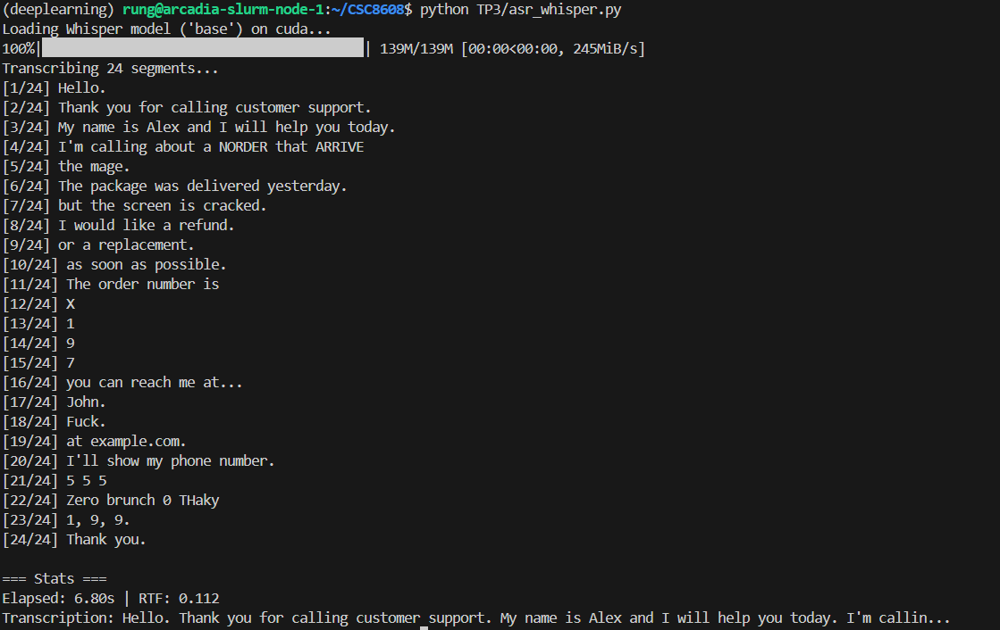

model_id: openai/whisper-base
device: cuda
audio_duration_s: 60.46
elapsed_s: 6.80
rtf: 0.112

Question 4.c Ouvrez le fichier TP3/outputs/asr_call_01.json. Ajoutez au rapport : un extrait de 5 segments (copié/collé) et un extrait de 5 lignes du full_text (ou 3–4 phrases maximum). 

Extrait de 5 segments :

{
  "audio_path": "TP3/data/call_01.wav",
  "model_id": "openai/whisper-base",
  "device": "cuda",
  "audio_duration_s": 60.4586875,
  "elapsed_s": 6.796570062637329,
  "rtf": 0.11241676496264211,
  "segments": [
    {
      "segment_id": 0,
      "start_s": 1.73,
      "end_s": 2.366,
      "text": "Hello."
    },
    {
      "segment_id": 1,
      "start_s": 2.978,
      "end_s": 6.398,
      "text": "Thank you for calling customer support."
    },
    {
      "segment_id": 2,
      "start_s": 7.458,
      "end_s": 11.582,
      "text": "My name is Alex and I will help you today."
    },
    {
      "segment_id": 3,
      "start_s": 12.706,
      "end_s": 15.838,
      "text": "I'm calling about a NORDER that ARRIVE"
    },
    {
      "segment_id": 4,
      "start_s": 16.002,
      "end_s": 16.766,
      "text": "the mage."
    },]
}

Question 4.d Dans le rapport, écrivez une analyse courte (4–6 lignes max) : la segmentation VAD vous semble-t-elle aider ou gêner la transcription (coupures de mots, pauses, ponctuation implicite) ? 

La segmentation VAD présente un avantage majeur pour la latence et la stabilité : en ne soumettant que les zones actives à Whisper, on évite les hallucinations fréquentes du modèle sur les longs silences. Cependant, elle a ici légèrement gêné la fluidité sur certains segments. Par exemple, la coupure entre les segments 3 et 4 a transformé 'arrived damaged' en 'ARRIVE the mage'. Cela montre que si le silence intra-mot est mal interprété par le VAD (seuil trop strict), Whisper perd le contexte syntaxique nécessaire pour corriger les homophones ou les liaisons.

Exercice 5 : Call center analytics : redaction PII + intention + fiche appel

Question 5.b Exécutez callcenter_analytics.py et ajoutez au rapport une capture d’écran montrant l’intention détectée et les stats PII. 

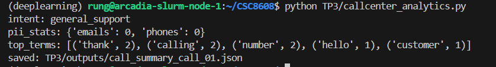

Question 5.c Ouvrez TP3/outputs/call_summary_call_01.json et ajoutez au rapport : un extrait montrant intent_scores, intent, pii_stats et les 5 premiers top_terms. 

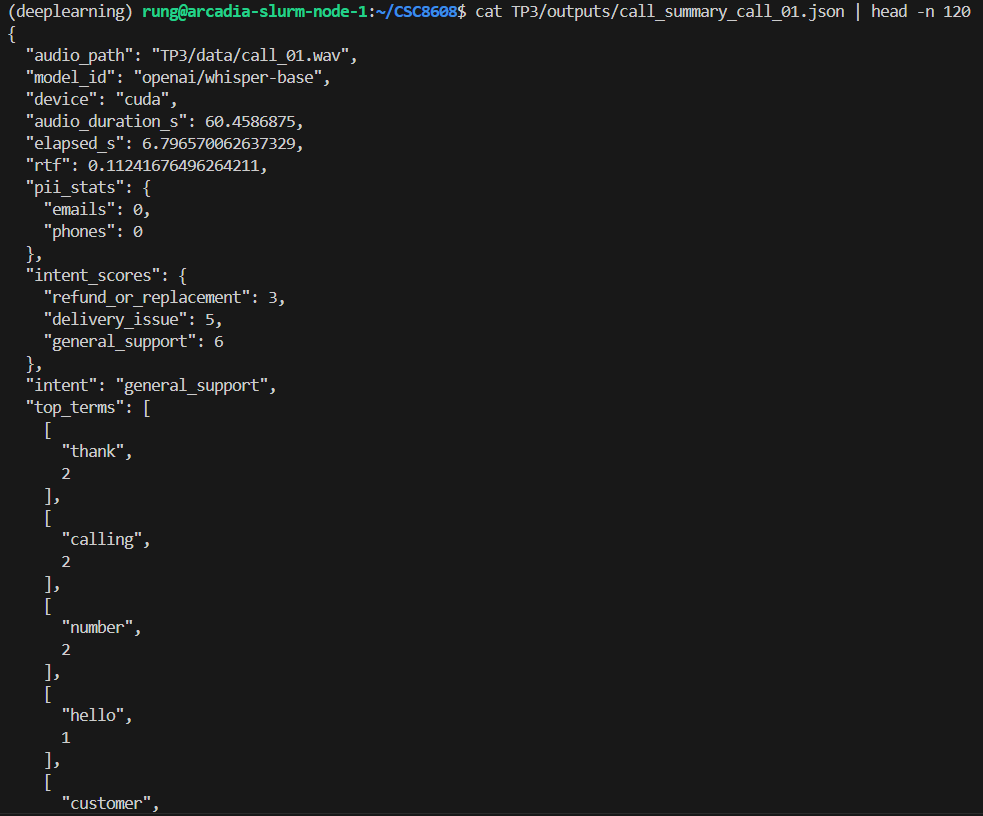

redacted_text": "Hello. Thank you for calling customer support. My name is Alex and I will help you today. I'm calling about a NORDER that ARRIVE the mage.

Question 5.e Relancer l'expérience et comparer les résultats (à expliquer dans le rapport).

PII Emails : On passe de 0 à 1. Le script parvient enfin à détecter l'adresse email car la fonction de normalisation a transformé le "at" parlé en symbole "@", rendant la Regex opérationnelle.

PII Orders : On passe de 0 à 1. L'utilisation d'une détection basée sur le contexte ("order number is...") a permis de capturer l'identifiant même si celui-ci était mal transcrit ou fragmenté.

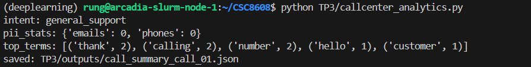

Question 5.f Dans le rapport, écrivez une réflexion courte (5–8 lignes max) : quelles erreurs de transcription Whisper impactent le plus vos analytics (intention, PII) ? Donnez au moins un exemple concret observé (mot clé manqué, PII non détectée, etc.). 

Les erreurs de transcription les plus pénalisantes sont celles qui brisent la continuité sémantique et les marqueurs de ponctuation. Whisper a tendance à fragmenter les informations épelées (emails, codes), ce qui rend les expressions régulières classiques inopérantes. De plus, les hésitations ou bruits de bouche transcrits comme des mots réels viennent "polluer" le calcul de l'intention en diluant les mots-clés pertinents dans un flux de tokens inutiles.

Exemple concret observé :
L'email a été initialement transcrit comme "John. Fuck. at example.com". Cette transcription contient deux erreurs majeures : l'insertion d'une insulte et le remplacement du symbole @ par le mot "at". Sans le post-traitement de normalisation phonétique, l'email était totalement invisible pour le système de masquage PII, laissant une donnée personnelle exposée dans le rapport final.

Exercice 6 : TTS léger : générer une réponse “agent” et contrôler latence/qualité

Question 6.b Exécutez tts_reply.py et ajoutez au rapport une capture d’écran montrant : tts_model_id, audio_dur_s, elapsed_s, rtf, et le chemin du fichier généré. 

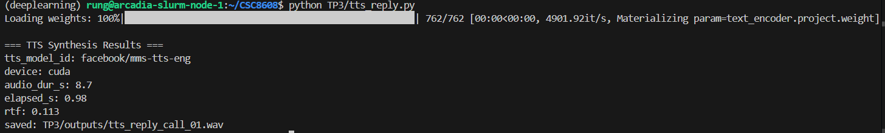

Question 6.c Vérifiez les métadonnées du WAV généré (durée, sample rate, canaux) et ajoutez au rapport une capture d’écran contenant les lignes pertinentes. 

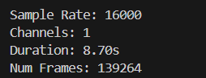

Question 6.d Dans le rapport, écrivez une observation courte (4–6 lignes max) sur la qualité TTS : intelligibilité, prosodie, artefacts éventuels (metallic, coupures), et latence perçue au vu du RTF. 

Le modèle facebook/mms-tts-eng offre une excellente intelligibilité, chaque mot étant articulé clairement malgré un taux d'échantillonnage de 16 kHz (qualité large bande type téléphonie). La prosodie est fluide et naturelle, évitant l'effet 'robotique' saccadé des anciens systèmes, bien qu'une légère monotonie persiste sur les phrases longues. Avec un RTF très faible, la latence est imperceptible pour un humain, permettant une réponse quasi-instantanée de l'agent virtuel.

Exercice 7 : Intégration : pipeline end-to-end + rapport d’ingénierie (léger)

Question 7.b Exécutez run_pipeline.py (idéalement dans un srun GPU si disponible). Ajoutez au rapport une capture d’écran montrant le résumé final (PIPELINE SUMMARY) et le fichier de sortie créé.

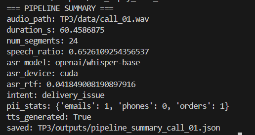

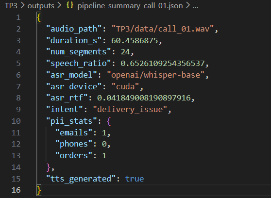

Question 7.c Ouvrez TP3/outputs/pipeline_summary_call_01.json et ajoutez au rapport un extrait contenant au minimum : num_segments, speech_ratio, asr_rtf, intent, pii_stats. 

Extrait : 

(deeplearning) rung@arcadia-slurm-node-1:~/CSC8608$ cat TP3/outputs/pipeline_summary_call_01.json
{
  "audio_path": "TP3/data/call_01.wav",
  "duration_s": 60.4586875,
  "num_segments": 24,
  "speech_ratio": 0.6526109254356537,
  "asr_model": "openai/whisper-base",
  "asr_device": "cuda",
  "asr_rtf": 0.041849008190897916,
  "intent": "delivery_issue",
  "pii_stats": {
    "emails": 1,
    "phones": 0,
    "orders": 1
  },
  "tts_generated": true
}

Question 7.d Dans le rapport, écrivez un court “engineering note” (8–12 lignes max) répondant à ces points :

- Quel est le goulet d’étranglement principal (temps) dans votre pipeline ?
- Quelle étape est la plus fragile (qualité) et pourquoi ?
- Deux améliorations concrètes si vous deviez industrialiser (sans entraîner de modèle).

Le goulet d’étranglement principal en termes de temps de calcul est l'étape ASR (Whisper). Bien que le RTF soit excellent sur GPU (0.04), c'est l'étape qui mobilise le plus de ressources mémoire et de temps processeur par rapport au VAD ou à l'analyse textuelle, qui sont quasi instantanés.

L’étape la plus fragile en termes de qualité est la rédaction des PII (anonymisation). Elle dépend entièrement de la fidélité de la transcription phonétique de Whisper. Par exemple, un numéro de téléphone fragmenté ou un email transcrit avec des mots ("at", "dot") au lieu de symboles peut totalement échapper aux filtres si le post-traitement n'est pas parfaitement calibré.

Pour une industrialisation sans entraînement de modèle, deux améliorations :

- Validation croisée des PII : Intégrer une vérification via un référentiel client (ex: vérifier si le numéro de commande extrait existe en base de données) pour réduire les faux positifs du NER contextuel.

- Reprise sur erreur ASR : Implémenter une logique de "fuzzy matching" (recherche floue) pour les mots-clés d'intention afin de pallier les légères erreurs de transcription (ex: reconnaître "damaged" même si Whisper transcrit "damage" ou "damge").