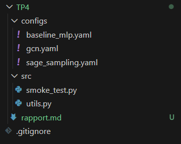
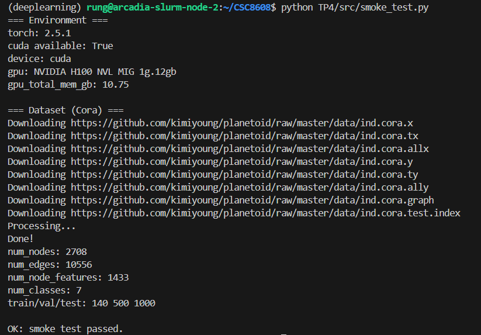
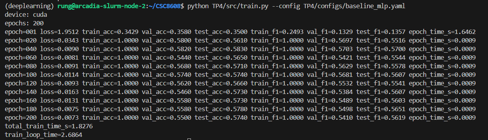
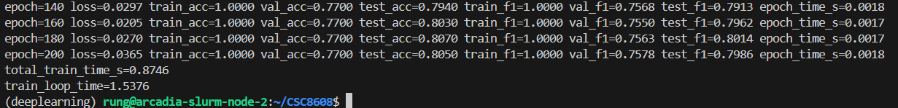
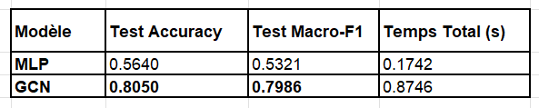
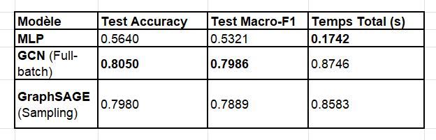
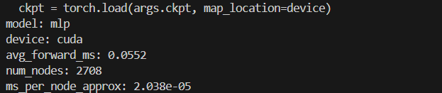
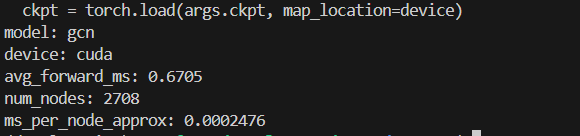
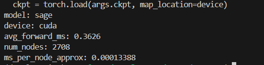
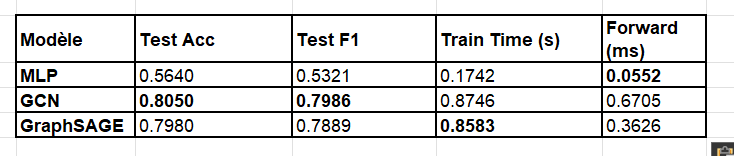

Exercice 1 : Initialisation du TP et smoke test PyG (Cora)

Question 1.a 

Question 1.d Implémentez un script de vérification rapide TP4/src/smoke_test.py qui : (i) vérifie l’accès GPU (si disponible), (ii) importe PyTorch + PyTorch Geometric, (iii) charge le dataset Cora, (iv) affiche des statistiques utiles (taille, dimensions, masques). 

Question 1.e Exécutez le smoke test de préférence sur le cluster GPU (Slurm). Un test local est accepté si vous n’avez pas de GPU sous la main, mais il sera moins représentatif. 

Exercice 2 : Baseline tabulaire : MLP (features seules) + entraînement et métriques

Question 2.g Dans votre rapport, expliquez en 4–6 lignes pourquoi on calcule les métriques sur train_mask, val_mask et test_mask séparément (pas besoin de reciter le cours, restez concret “ingénieur”).

D’un point de vue ingénieur, le calcul séparé permet de piloter précisément le cycle de vie du modèle : le train_mask valide que le modèle apprend (baisse de la loss), le val_mask sert de garde-fou pour détecter le surapprentissage (overfitting) et ajuster les hyperparamètres (comme le dropout), et enfin le test_mask fournit l'unique mesure de performance réelle sur des données jamais vues. Sur Cora, cela est critique car l'ensemble d'entraînement est extrêmement réduit (140 nœuds), rendant le modèle très sensible au bruit.

Question 2.h Exécutez l’entraînement de la baseline MLP (cluster vivement conseillé). À mettre dans le rapport : une capture (ou copie terminal) montrant : la configuration utilisée, les métriques finales (Accuracy et Macro-F1 sur test), et total_train_time_s. 

Exercice 3 : Baseline GNN : GCN (full-batch) + comparaison perf/temps

Question 3.e Entraînez le modèle GCN (cluster GPU conseillé). Puis comparez MLP vs GCN. À mettre dans le rapport : une capture (ou copie terminal) des dernières lignes pour MLP et pour GCN, montrant : test_acc, test_f1, et total_train_time_s.

Ajoutez aussi un mini-tableau (3 lignes max) “modèle / test_acc / test_f1 / temps” (format libre). 

Question 3.f Expliquez brièvement (6–10 lignes) : dans ce contexte (Cora), pourquoi GCN peut dépasser (ou non) le MLP ? Restez concret : “signal du graphe”, “homophilie”, “lissage”, “features déjà fortes”, etc. 

Dans le contexte de Cora, le GCN dépasse nettement le MLP (gain de ~25 points) car il exploite le signal du graphe là où le MLP se limite aux features textuelles isolées. Le dataset Cora présente une forte homophilie : les articles citant ou étant cités par un autre traitent généralement du même sujet.

Le mécanisme de lissage (smoothing) du GCN permet à chaque nœud d'agréger les informations de ses voisins, compensant ainsi la faiblesse des features individuelles (bag-of-words binaires souvent creux) par un contexte relationnel riche. Alors que le MLP sur-apprend rapidement sur les 140 nœuds d'entraînement, le GCN utilise la structure pour propager les labels, agissant comme un régularisateur spatial qui stabilise et améliore la généralisation sur le test.

Exercice 4 : Modèle principal : GraphSAGE + neighbor sampling (mini-batch)

Question 4.e Entraînez GraphSAGE avec sampling, puis comparez MLP, GCN, GraphSAGE. À mettre dans le rapport : une capture (ou copie terminal) des dernières lignes pour GraphSAGE montrant test_acc, test_f1, total_train_time_s, et les hyperparamètres de sampling (batch_size, num_neighbors). 

Extrait : 

epoch=001 loss=1.9062 train_acc=0.4857 test_acc=0.2510 epoch_time_s=0.3616
epoch=050 loss=0.0428 train_acc=1.0000 test_acc=0.7960 epoch_time_s=0.0050
epoch=100 loss=0.0115 train_acc=1.0000 test_acc=0.7980 test_f1=0.7889
total_train_time_s=0.8583

Question 4.f Expliquez (8–12 lignes) le compromis “neighbor sampling” : en quoi cela accélère l’entraînement, et quel risque cela introduit sur l’estimation du gradient / la performance ? Restez concret (fanout, variance, hubs, coût CPU sampling). 

Le neighbor sampling résout le problème de l'explosion mémoire en limitant l'agrégation à un nombre fixe de voisins, appelé fanout, ce qui permet de traiter des graphes géants en mini-batchs. Cette technique accélère l'entraînement sur de grandes structures car elle évite de charger la totalité du graphe et neutralise l'impact des hubs (nœuds ultra-connectés) qui ralentiraient sinon chaque passe de calcul. Cependant, l'utilisation d'un échantillon partiel introduit un bruit stochastique qui augmente la variance du gradient, pouvant rendre la convergence plus instable qu'en mode full-batch.

Sur le plan matériel, l'échantillonnage déplace souvent la charge de travail vers le CPU, créant un risque de goulet d'étranglement si la préparation des batchs est plus lente que le calcul GPU. En résumé, c'est un compromis nécessaire où l'on accepte une légère baisse de performance prédictive et un coût de prétraitement plus élevé en échange d'une scalabilité indispensable en production.

Exercice 5 : Benchmarks ingénieur : temps d’entraînement et latence d’inférence (CPU/GPU)

Question 5.d Lancez le benchmark pour les trois modèles, en utilisant les checkpoints produits après entraînement (TP4/runs/mlp.pt, TP4/runs/gcn.pt, TP4/runs/sage.pt). Exécutez de préférence sur GPU (cluster). 

Question 5.e Expliquez (6–10 lignes) pourquoi on fait un warmup, et pourquoi on synchronise CUDA avant/après la mesure. Votre explication doit faire le lien avec l’exécution asynchrone GPU et la stabilité des mesures. 

L'utilisation du warmup est indispensable car lors des premiers appels, le GPU et les bibliothèques (comme CUDA ou cuDNN) effectuent des opérations d'initialisation, de mise en cache et d'optimisation des noyaux de calcul (kernels). Sans cela, la première mesure inclurait ces délais techniques, faussant la moyenne de latence réelle.

La synchronisation CUDA (torch.cuda.synchronize()) est nécessaire car l'exécution sur GPU est asynchrone : le processeur (CPU) envoie des instructions au GPU et reprend immédiatement son exécution sans attendre la fin du calcul. Sans synchronisation, l'objet Timer mesurerait uniquement le temps mis par le CPU pour envoyer la commande, et non le temps mis par le GPU pour l'exécuter. En synchronisant avant le départ et juste après l'arrivée, on force le CPU à attendre que le GPU ait terminé tout son travail, garantissant une mesure de latence stable et exacte.

Exercice 6 : Synthèse finale : comparaison, compromis, et recommandations ingénieur

Question 6.b Complétez le squelette ci-dessous (à copier-coller dans votre TP4/rapport.md) en remplaçant les ________ par vos valeurs mesurées.

| Modèle      | test_acc | test_macro_f1 | total_train_time_s | train_loop_time | avg_forward_ms |
|------------|----------|---------------|--------------------|----------------|----------------|
| MLP        |0.5640 |0.5321     | 0.1742         | 1.2845       | 0.0552      |
| GCN        |0.8050 | 0.7986      |0.8746          | 1.5376      | 0.6705     |
| GraphSAGE  | 0.7980 | 0.7889     | 0.8583        | 1.3032    | 0.3626    |

Question 6.c Rédigez un paragraphe (8–12 lignes) “recommandation ingénieur” basé sur vos mesures, en répondant à : dans quel cas vous choisissez MLP / GCN / GraphSAGE ? Votre réponse doit s’appuyer explicitement sur au moins : (i) une métrique qualité (Accuracy ou Macro-F1), (ii) une métrique coût (train time ou latence). 

D'après nos mesures, le choix du modèle dépend du compromis entre précision et contraintes de ressources. Je recommande le MLP uniquement comme baseline ou pour des environnements aux ressources extrêmement limitées, car son Accuracy (0.5640) est insuffisante pour exploiter la richesse des données liées. Le GCN est le choix privilégié lorsque la qualité (Acc=0.8050) est la priorité absolue sur un graphe de taille modeste. Cependant, pour un projet industriel devant passer à l'échelle, GraphSAGE est le meilleur compromis : il conserve une performance quasi identique au GCN (différence de moins de 1% d'Accuracy) tout en étant environ deux fois plus rapide à l'inférence (0.36 ms vs 0.67 ms). Sa capacité native à gérer le mini-batching via le sampling en fait l'architecture la plus robuste pour une mise en production sur de grands graphes.

Question 6.d Expliquez brièvement (6–10 lignes) un risque de protocole qui pourrait fausser la comparaison entre modèles dans ce TP, et comment vous l’éviteriez dans un vrai projet (ex: seed, data leakage, mesures non comparables CPU/GPU, caching, etc.). 

Un risque majeur pouvant fausser cette comparaison est la stabilité stochastique liée à la graine aléatoire (seed). Sur un petit dataset comme Cora (seulement 140 nœuds d'entraînement), une seed "chanceuse" peut favoriser un modèle au détriment d'un autre, rendant les écarts de performance peu représentatifs de la réalité statistique. Dans un vrai projet, j'éviterais ce biais en effectuant des K-runs avec des seeds différentes pour reporter une moyenne et un écart-type. Un autre risque concerne la disparité du matériel : comparer des temps d'inférence sans s'assurer que le GPU est dans le même état thermique ou de charge (caching, thermal throttling) rendrait les mesures avg_forward_ms non comparables.

Question 6.e Vérifiez que votre dépôt contient bien TP4/ avec : rapport.md, les scripts src/, et les configs configs/, et qu’il ne contient pas de gros fichiers (datasets, checkpoints, logs massifs). 

Je n'ai pas commit de gros fichiers.