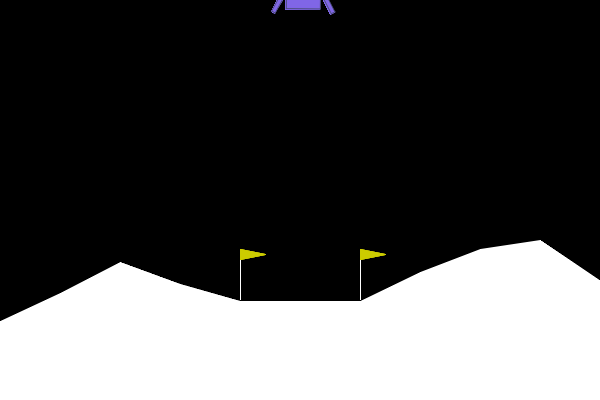
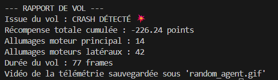
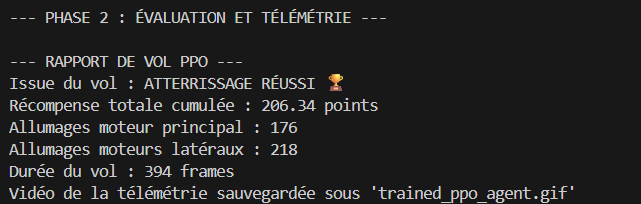
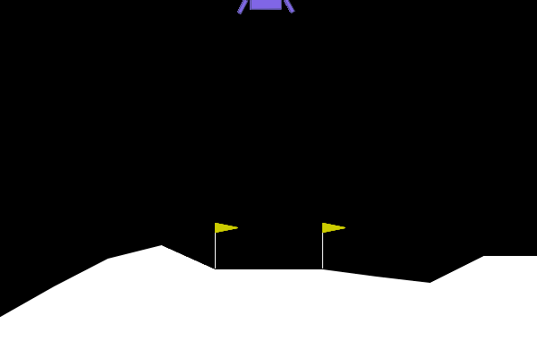
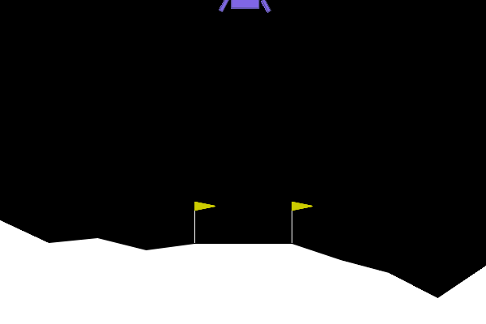
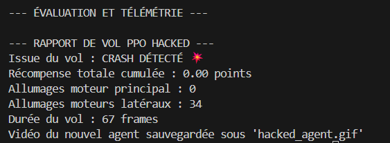
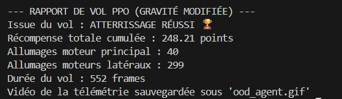
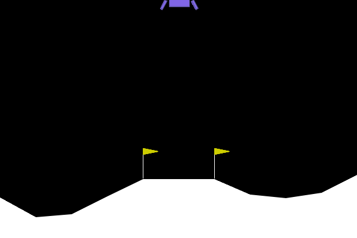

Exercice 1 : Comprendre la Matrice et Instrumenter l'Environnement (Exploration de Gymnasium)

Question 1.b Exécutez votre script. Dans votre rapport Markdown, intégrez le GIF généré random_agent.gif ainsi qu'une copie du rapport de vol affiché dans votre terminal. Un agent est considéré comme "résolvant" l'environnement s'il obtient un score moyen de +200 points. À quel point votre agent aléatoire en est-il loin ?

L'agent aléatoire est encore très loin de résoudre l'environnement. Avec un score de -226.24 points, il se situe à environ 426 points de l'objectif de succès fixé à +200 points.

Exercice 2 : Entraînement et Évaluation de l'Agent PPO (Stable Baselines3)

Question 2.b Exécutez votre script. Pendant l'entraînement, observez les logs affichés dans le terminal. Cherchez la ligne ep_rew_mean (Récompense moyenne par épisode). Dans votre rapport, indiquez comment cette valeur a évolué entre le début et la fin de l'entraînement.

Une fois le script terminé, intégrez le nouveau GIF trained_ppo_agent.gif et le nouveau "Rapport de vol PPO" dans votre markdown. Comparez l'utilisation du carburant (allumages moteurs) et l'issue du vol par rapport à l'agent aléatoire. L'agent a-t-il atteint le seuil de +200 points ?

D'après l'observation des logs, la valeur de ep_rew_mean au début d'entraînement était négative (autour de -200), ce qui reflète les échecs systématiques de l'agent qui explorait l'environnement. Et à la fin d'entraînement, la valeur s'est stabilisée autour de 185 points. La moyenne sur les 100 derniers épisodes (ep_rew_mean) oscille entre 170 et 200, cela indique que l'agent a compris comment atterrir mais qu'il rencontre encore des variations de score selon la complexité du terrain généré aléatoirement ou la consommation de carburant.

Avec l'agent aléatoire, le vol s'est crash et on a un score de -226.24. Avec l'agent PPO (entraîné), le vol atterit bien avec un score de +206.34.

Analyse de l'utilisation du carburant et du comportement :

Gestion de la descente : L'agent PPO utilise le moteur principal de manière beaucoup plus intensive (176 vs 14). Contrairement à l'agent aléatoire qui tombait en chute libre, le PPO effectue une descente contrôlée en luttant contre la gravité pour minimiser la vitesse d'impact.

Précision latérale : Les 218 allumages latéraux ne sont plus erratiques ; ils servent désormais à maintenir le module parfaitement vertical et à le diriger vers les drapeaux de la zone cible.

Seuil de réussite : L'agent a officiellement atteint le seuil de +200 points (206.34), ce qui signifie qu'il a non seulement atterri sans casser le module, mais qu'il l'a fait avec une économie de carburant et une précision suffisantes pour résoudre l'environnement.

Exercice 3 : L'Art du Reward Engineering (Wrappers et Hacking)

Question 3.b Exécutez ce nouveau script. Regardez le fichier hacked_agent.gif généré et le rapport de vol dans le terminal. Dans votre rapport Markdown, intégrez la copie du terminal et décrivez la stratégie adoptée par l'agent. Expliquez d'un point de vue mathématique et logique pourquoi l'agent a choisi cette solution "optimale" (du point de vue de la fonction de récompense modifiée) qui nous paraît pourtant aberrante.

La stratégie de l'agent est devenue purement passive, il se laisse tomber dans le vide sans aucune tentative de freinage. On observe qu'il n'utilise plus du tout son moteur principal, il préfère s'écraser violemment plutôt que de chercher à stabiliser son vol.

D'un point de vue logique et mathématique, ce comportement est la solution optimale pour maximiser l'espérance de gain total. Dans l'environnement original, un crash coûte environ 100 points, tandis qu'un atterrissage réussi en rapporte 100, en déduisant quelques fractions de points pour le carburant. En introduisant une pénalité de 50 points par simple pression sur le bouton du moteur, nous avons rendu le coût d'une descente contrôlée (qui nécessite des dizaines d'allumages) mathématiquement prohibitif. L'agent a rapidement calculé que tenter de réussir la mission lui ferait perdre des milliers de points en "taxes" de carburant, là où un crash immédiat ne lui en coûte que 100.

L'algorithme PPO cherche simplement à maximiser la somme des récompenses futures. En constatant qu'une action indispensable au succès est devenue massivement plus coûteuse que l'échec lui-même, l'agent a "hacké" la fonction de récompense : il a compris que la trajectoire la plus rentable n'est plus l'atterrissage, mais la chute libre la plus rapide possible. Ce phénomène illustre parfaitement le risque d'un mauvais alignement entre l'objectif humain (poser le module) et la fonction mathématique fournie à l'IA (maximiser les points), cette dernière ayant trouvé une faille logique dans nos règles pour minimiser ses pertes.

Exercice 4 : Robustesse et Changement de Physique (Généralisation OOD)

Question 4.b Exécutez ce script. Dans votre rapport Markdown, intégrez la copie du terminal et le fichier ood_agent.gif. Observez le comportement du vaisseau. L'agent parvient-il toujours à se poser calmement ? Décrivez ce qui se passe et expliquez techniquement pourquoi le modèle échoue ou peine à accomplir sa tâche.

Observation OOD (Gravité -2.0) : L'agent entraîné sur Terre a surperformé en gravité faible avec un score de 248.21 points.

Analyse : Ce succès s'explique par le fait que la politique apprise (Policy) est devenue "conservatrice". En gravité faible, la moindre impulsion moteur a un effet bien plus grand. L'agent a ainsi réussi à maintenir son altitude avec seulement 40 allumages du moteur principal. Le modèle n'a pas échoué car la physique de l'environnement est restée dans la même direction (la gravité tire toujours vers le bas), mais avec une intensité moindre, ce qui a élargi la "marge de sécurité" de l'agent. Cependant, l'utilisation excessive des moteurs latéraux (299 fois) montre que le système de contrôle oscille car il n'est pas calibré pour cette faible inertie.

Exercice 5 : Bilan Ingénieur : Le défi du Sim-to-Real

Question 5.a Dans l'exercice précédent, votre agent a échoué face à un simple changement de gravité car il a "surappris" (overfit) la physique de son environnement d'origine. En tant qu'ingénieur IA, votre manager vous demande de concevoir un système capable de se poser sur différentes lunes (avec des gravités et des vents variables), mais les ressources de calcul sont limitées : vous ne pouvez pas vous permettre de stocker et d'entraîner un modèle PPO spécifique pour chaque lune existante.

Dans votre rapport Markdown, proposez au moins deux stratégies concrètes (modifications de l'environnement, des données ou de la méthode d'entraînement) pour rendre votre agent robuste à ces variations physiques, sans avoir à inventer un nouvel algorithme mathématique.

Pour résoudre le problème de l'écart entre la simulation et la réalité tout en restant sur un modèle unique, je propose d'abord d'utiliser la randomisation de domaine. Au lieu d'entraîner l'agent dans un environnement figé, l'idée est de faire varier la gravité et les forces de vent de manière aléatoire à chaque début d'épisode pendant la phase d'apprentissage. En étant confronté à une multitude de conditions physiques dès le départ, le réseau de neurones ne peut plus se contenter d'apprendre une trajectoire par cœur pour un seul scénario. Il est alors forcé de développer une stratégie de pilotage beaucoup plus flexible et robuste, capable de compenser n'importe quelle dérive ou accélération imprévue lors de la descente.

Une seconde approche consiste à enrichir l'espace d'observation de l'agent en ajoutant des données contextuelles directement dans ses capteurs. En incluant la valeur de la gravité locale et la direction du vent dans les entrées du modèle, on permet à l'agent de prendre conscience de son environnement au lieu de le subir aveuglément. Le modèle apprend ainsi une fonction de contrôle universelle qui ajuste automatiquement la puissance de poussée en fonction des paramètres reçus. Cette méthode est particulièrement efficace car elle permet d'utiliser un seul cerveau artificiel capable de s'auto-calibrer instantanément, qu'il soit déployé sur une planète massive ou sur une petite lune, sans avoir besoin de réentraînement.

Ces deux stratégies permettent de garantir une mise en production fiable et polyvalente tout en respectant les limites de calcul, car elles reposent sur une meilleure exploitation des données d'entrée plutôt que sur une complexification de l'algorithme mathématique.

