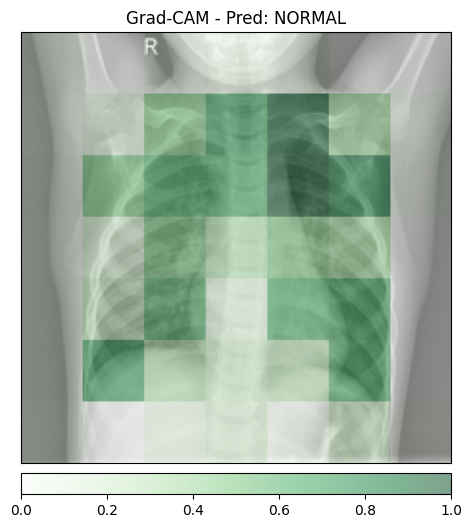
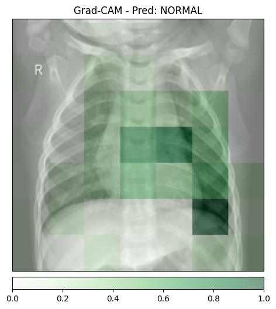
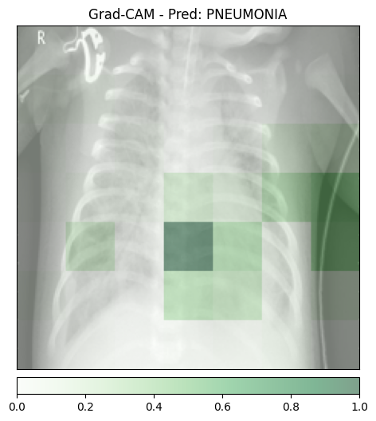
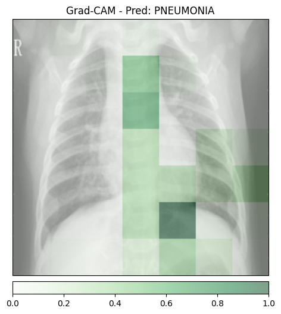
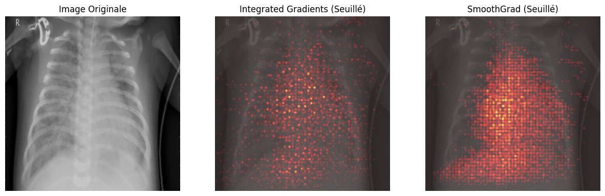
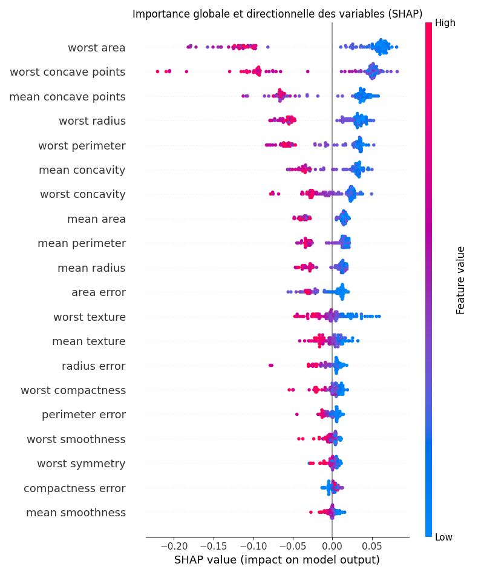

Exercice 1 : Mise en place, Inférence et Grad-CAM

Question 1.d Exécutez votre script sur les trois images téléchargées (normal_1.jpeg, normal_2.jpeg, pneumo_1.jpeg, pneumo_2.jpeg). Dans votre fichier rapport.md, incluez :

- Les trois images Grad-CAM générées.

- Analyse des Faux Positifs : Le modèle devrait prédire "PNEUMONIA" même pour l'image saine. En observant la zone mise en évidence par Grad-CAM sur cette erreur, le modèle regarde-t-il une anomalie pulmonaire, ou se base-t-il sur un artefact de la radiographie (effet Clever Hans) ?

En observant les images prédites comme NORMAL et celles marquées PNEUMONIA, on remarque que sur plusieurs des images (notamment les deux premières), la zone de chaleur Grad-CAM s'active de manière intense sur le bord droit ou gauche de l'image. Si le modèle prédit une pathologie en se focalisant sur ces zones plutôt que sur le parenchyme pulmonaire (le centre des poumons), c'est une preuve de l'effet Clever Hans.

Le modèle n'analyse pas une anomalie médicale, mais utilise un raccourci statistique (un artefact) présent plus fréquemment dans les clichés de patients malades du dataset d'entraînement pour valider sa décision.

- Granularité : Que remarquez-vous concernant la résolution de l'explication (les zones colorées ressemblent à de gros blocs flous) ? Sachant que l'on extrait l'information de la dernière couche d'un ResNet, expliquez d'où vient cette perte de résolution spatiale.

Concernant l'aspect visuel de l'explication, il est normal que les zones colorées ressemblent à de gros blocs flous. Cette faible résolution est une conséquence directe de l'architecture du ResNet utilisé. Au fur et à mesure que l'image traverse les couches du réseau, sa résolution spatiale est divisée par des opérations de pooling et de convolution à foulée (stride). Alors que l'image d'entrée est nette, l'information qui arrive à la dernière couche convolutive — celle que nous utilisons pour Grad-CAM — a été compressée jusqu'à atteindre une grille minuscule de seulement 7×7 pixels. our afficher l'explication sur la radiographie originale, nous devons agrandir mathématiquement cette grille. Ce processus d'interpolation étire chaque pixel de la couche profonde pour en faire un large carré de couleur, ce qui explique poPurquoi l'explication manque de finesse et ne permet pas de délimiter précisément les contours d'une petite lésion.

Exercice 2 : Integrated Gradients et SmoothGrad

Question 2.d Soumettez ce script sur votre cluster. Dans rapport.md :

- Ajoutez l'image comparative générée.

- Relevez les temps d'exécution. Au vu du temps de calcul de SmoothGrad par rapport à une inférence classique, pensez-vous qu'il soit technologiquement possible de générer cette explication de manière synchrone (en temps réel) pour un médecin lors du premier clic d'analyse ? Proposez une architecture logicielle en une phrase pour résoudre ce problème (ex: utilisation de files d'attente).

Temps IG pur : 1.4823s
Temps SmoothGrad (IG x 100) : 14.6913s

Au vu de ces résultats, il n'est pas technologiquement possible de générer cette explication de manière synchrone pour un médecin. Alors qu'une prédiction classique prend une fraction de seconde, attendre près de 15 secondes pour voir l'explication briserait totalement le flux de travail clinique et l'interactivité de l'interface. Pour résoudre ce problème, il est préférable d'adopter une architecture asynchrone utilisant des files d'attente de tâches (type Redis/Celery) : l'inférence donne un résultat immédiat au médecin, tandis que l'explication (IG/SmoothGrad) est calculée en arrière-plan et "poussée" vers l'interface dès qu'elle est prête.

- En observant les couleurs de la visualisation finale (bleu et rouge), expliquez brièvement l'avantage mathématique d'avoir une carte qui descend "en dessous de zéro" par rapport au filtre ReLU classique utilisé dans Grad-CAM.

En observant les visualisations, l'avantage majeur d'Integrated Gradients sur Grad-CAM réside dans la gestion des attributions négatives.

Contrairement à Grad-CAM qui utilise un filtre ReLU pour ne garder que les influences positives (en "ignorant" ce qui contredit la classe), les méthodes basées sur les gradients permettent d'avoir des valeurs qui descendent "en dessous de zéro". Mathématiquement, cela permet de distinguer les pixels qui appuient le diagnostic (en rouge) de ceux qui le contredisent ou pointent vers une structure saine (qui seraient en bleu si on ne prenait pas la valeur absolue). Cette approche respecte l'axiome de complétude : la somme de toutes les attributions (positives et négatives) égale exactement la différence entre le score de l'image réelle et celui d'une image noire de référence, offrant ainsi une fidélité mathématique bien plus rigoureuse que le flou sémantique de Grad-CAM.

Exercice 3 : Modélisation Intrinsèquement Interprétable (Glass-box) sur Données Tabulaires

Question 3.b Exécutez ce script sur votre machine ou votre cluster. Dans votre rapport.md :

- Ajoutez l'image glassbox_coefficients.png générée.

- En observant le graphique, identifiez la caractéristique (feature) qui a le plus d'impact pour pousser la prédiction vers la classe "Maligne" (classe 0, coefficients négatifs).

D'après le graphique généré (glassbox_coefficients.png), la caractéristique qui a le plus d'impact pour pousser la prédiction vers la classe "Maligne" (classe 0, associée aux coefficients négatifs les plus élevés) est worst texture. Son coefficient est le plus éloigné de zéro sur la gauche (environ -1.35), ce qui signifie mathématiquement qu'une augmentation de cette valeur diminue très fortement la probabilité que la tumeur soit classée comme bénigne.

- Expliquez en une phrase l'avantage d'avoir un modèle directement interprétable par rapport aux méthodes post-hoc vues précédemment.

L'avantage majeur d'un modèle directement interprétable est qu'il fournit une explication exacte et fidèle à son propre fonctionnement interne, garantissant une transparence totale sans avoir recours à des approximations ou à des calculs supplémentaires coûteux nécessaires aux méthodes post-hoc.

Exercice 4 : Explicabilité Post-Hoc avec SHAP sur un Modèle Complexe

Question 4.c Exécutez le script et récupérez les deux images générées. Dans votre rapport.md :

- Ajoutez les images shap_waterfall.png et shap_summary.png.

- Explicabilité Globale : En regardant le Summary Plot, vérifiez si les 2-3 variables les plus importantes identifiées par le Random Forest (SHAP) sont les mêmes que celles trouvées par la Régression Logistique (Exercice 3). Que déduisez-vous sur la robustesse de ces caractéristiques cliniques (biomarqueurs) ?

En comparant le Summary Plot (Random Forest) et le graphique des coefficients de la Régression Logistique :

Observation des variables : On constate une forte convergence sur les biomarqueurs les plus critiques. Les caractéristiques worst area, worst concave points et worst radius figurent parmi les plus importantes dans les deux modèles.

Analyse de la robustesse : Le fait que deux modèles aux principes mathématiques totalement différents (linéaire vs ensemble d'arbres décisionnels) identifient les mêmes variables dominantes démontre la grande robustesse de ces caractéristiques cliniques. Ces variables constituent des biomarqueurs fiables, car leur pouvoir prédictif est une propriété intrinsèque des données médicales elles-mêmes et non un artefact lié au choix de l'algorithme.

- Explicabilité Locale : En analysant le Waterfall Plot du patient 0, citez la caractéristique (feature) ayant le plus contribué à tirer la prédiction vers sa valeur finale, ainsi que la valeur numérique exacte de cette caractéristique pour ce patient précis.

En analysant le Waterfall Plot du patient 0, pour lequel le modèle prédit un score de 0.97 (classe Bénigne) :

Caractéristique dominante : La variable ayant le plus contribué à tirer la prédiction vers sa valeur finale est worst area.

Impact et valeur exacte : Cette caractéristique a apporté une contribution positive de +0.07 au score final. La valeur numérique exacte de cette caractéristique pour ce patient précis est de 677.9.

